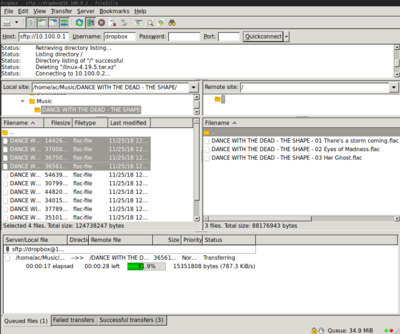

# sftpplease

This program acts as a secure bridge between an ssh server and supported cloud providers.
This lets you use sftp and scp client to access cloud prividers like dropbox without
installing any closed source software on your devices :).

Any sftp or scp client should work, I have tested with filezilla and openssh sftp/scp.

Sshfs will work in the future for simple transfers and directory listing, but will never work for random
file access such as running complex applications.

# Project Status

Alpha, read only mode should be safe, but there are probably bugs.

Currently only dropbox is supported.

# Screenshots

Using filezilla to upload to dropbox:



# How to use:

First, compile sftpplease:
```
$ git clone https://github.com/andrewchambers/sftpplease
$ cd sftpplease/cmd/sftpplease
$ go build
$ ./sftpplease -help
```

Install the sftpplease binary on your desired server.

Next create a dedicated user account on your server, (for example a dropbox user).

Next create an authorized keys file with a forced command for this user:

```
restrict,command="/path/to/sftpplease -read-only -vfs dropbox:YOUR_API_TOKEN", ssh-rsa YOURSSHKEY...
```

Now you can use sftp and scp to access your dropbox account :):

```
$ sftp dropbox@your.server.com
ls
...
$ scp ./file.txt dropbox@your.server.com:/
```

# Currently supported providers

## Dropbox

### Creating a dropbox api token

- Visit https://www.dropbox.com/developers
- Go to 'My apps' (https://www.dropbox.com/developers/apps)
- Go to create app (https://www.dropbox.com/developers/apps/create)
- Follow the guides.
- Visit your app page.
- Click the 'Generate' bitton to generate an api access token, Use this token under -the 'vfs dropbox:YOUR_API_TOKEN' argument.

# Donating

If you are able to give a donation, it would help progress greatly.

- bitcoin: 34FrF1vr59Cg5Sz1Hnd17GPcqztCgpui48
- [paypal](https://www.paypal.com/cgi-bin/webscr?cmd=_s-xclick&hosted_button_id=FLUPKG253245L&source=url)

# Credits and thanks

- Vasily Kolobkov for writing the original scp implementation.
- Authors of https://github.com/pkg/sftp for providing the sftp package parsing code.
- Authors of https://github.com/anmitsu/go-shlex for providing shell parsing.